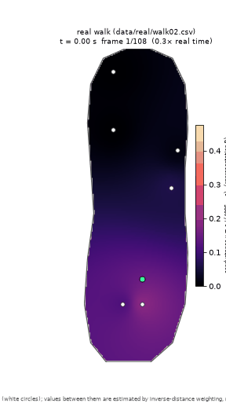

# Insole

**A shoe insole that recognises how you are walking.** Six force sensors under
a right insole, sampled at 100 Hz by an ESP32-S3, streamed to a laptop over USB
serial or Bluetooth, cut into individual footsteps, and classified by a
discriminant model written from scratch. Every stage has a simulator behind the
same interface as the hardware, so the whole pipeline runs — and is tested —
without a board.



*Centre of pressure moving heel-to-toe through one real walking stance,
interpolated between the six sensors. Generated by
[notebooks/demo.ipynb](notebooks/demo.ipynb) from a real capture.*

[**Demo notebook**](notebooks/demo.ipynb) · [**700-word writeup**](docs/writeup.md) · [**Full results**](docs/real_results.md) · [**Build photos and walkthrough video**](https://github.com/parsaileslamlou/Insole/releases/tag/demo-v1)

---

## What this is

- **Real hardware, real data.** Six Interlink FSR UX 402 sensors on a right
  insole, an ESP32-S3 on a perfboard carrier, a USB power bank so the rig walks
  untethered. Twelve captures in three sets, kept in
  [data/real/](data/real/) — including `_01`, the set that failed, kept as
  evidence rather than deleted.
- **Written from scratch.** The LDA/QDA classifier, the stance detector, the
  centre-of-pressure features, the frame codec and its checksum, the gait
  simulator and the fault injector are all in [insole/](insole/). sklearn
  appears only in the tests, as an oracle to check the discriminant against.
- **Runs with no board.** `./run_demo.sh` takes a fresh clone from simulated
  frames to per-stance predictions in about eight seconds.
- **Reported against a baseline.** Every accuracy below is quoted beside the
  score of guessing the commonest class, on a split that holds out whole
  recording sessions.

## Results

Three activities — **normal walk, fast walk, shuffle** — classified once per
foot contact ("stance"), using only the two centre-of-pressure features.

| | accuracy | 95 % interval | correct |
| --- | --- | --- | --- |
| **Shipped model** (conductance, QDA) | **0.598** | [0.533, 0.660] | 134 / 224 |
| Best cell under the pre-registered rule (raw counts) | 0.607 | [0.542, 0.669] | 136 / 224 |
| **Baseline — always guess the commonest class** | **0.415** | — | 93 / 224 |
| Best with all seven features (rides on cadence) | 0.758 | [0.698, 0.809] | 169 / 223 |

**In plain terms.** From the pressure distribution alone, the insole picks out
shuffling (0.69 recall) and fast walking (0.84) well, and largely fails to
separate normal walking from fast walking: walk recall is 0.21, with 39 of 67
walk stances called `fast`. That is the honest limit of two centre-of-pressure
features on six sensors. Adding contact time lifts the whole thing to 0.758 —
but then it is measuring cadence, not pressure, so it is reported separately
rather than as the headline.

**The split is session-disjoint.** Leave-one-session-out over two sessions per
activity: each fold holds out a whole recording session, so no stance is ever
scored by a model that saw its own session. The same recipe scored 0.667
within-session, so a session boundary costs about six points — the lower number
is the one quoted. Standing is not a class: a standing capture is one unbroken
contact for the full 60 s, so it yields no stances and is excluded.

**Why the simulator's 0.93 is not in that table.** The bake-off scores 0.9296
on 270 held-out *simulated* stances, and that number is worth nothing on its
own: the generator's constants, the detector thresholds and the tests over them
were co-evolved, so the result is internally consistent by construction. Point
the sim-trained model at real stances and it scores 0.379 — *below* the 0.415
baseline. That contrast is why the real-data number is the one reported.

> Every figure here regenerates with `python scripts/train_real.py`, which
> rewrites [docs/real_results.md](docs/real_results.md) in place; each model
> records the git hash of the run that fitted it. The intervals are Wilson
> intervals over pooled stances and are a **lower bound** on the uncertainty —
> 224 stances from two sessions of one subject are correlated, not independent.
> [docs/real_results.md](docs/real_results.md) carries the per-fold intervals,
> the confusion matrix and every misclassified stance.

## Quickstart

No hardware needed. Python 3.10+. Every command below was executed as written.

```bash
git clone https://github.com/parsaileslamlou/Insole.git && cd Insole
python3 -m venv .venv && source .venv/bin/activate   # Windows Git Bash: .venv/Scripts/activate
pip install -e ".[analysis,test,notebook]"
./run_demo.sh
```

```
DEMO OK: 60 stances on a 60 s simulated walk, predictions fast=6  walk=54, 60 rows written
```

`run_demo.sh` chains the three stages, which also run on their own:

```bash
python -m insole.gait_gen  --out demo_walk.txt --noise-seed 1      # simulate 60 s of walking
python -m insole.read_serial demo_walk.txt demo_walk.csv           # validate + log to CSV
python -m insole.infer_live  demo_walk.txt --model models/model_lda.json --quiet
```

```
stances completed=60 discarded>MAX_DURATION(200)=0 rejected<MIN_DURATION(15)=0 predicted=60
frames extrapolating (any sensor > 824 counts)=3420 (57.0%)  s4=0 frames=2388 (39.8%)
predictions: fast=6  walk=54
```

Then `python -m pytest -q` (49 passed), or open
[notebooks/demo.ipynb](notebooks/demo.ipynb), whose outputs are committed so it
reads on GitHub without running.

## How it works

```
 6x FSR ──1 kΩ dividers──> ESP32-S3 ADC1 (12-bit, 8x oversample, 100 Hz)
                                  │  INS,SEQ,TS_US,S0..S5,CHECKSUM\n
                     ┌────────────┴────────────┐
                USB CDC serial            BLE Nordic UART
                     └────────────┬────────────┘
                                  │  read_serial.make_source()  ── the seam ──┐
  insole/gait_gen.py  (sim)  ─────┤                                            │
  sim_*.txt fixtures         ─────┘                                            │
                                  ▼                                            │
                   FrameValidator: parse, checksum, seq/timing/reset counters   │
                     ┌────────────┴────────────┐                               │
          insole/read_serial.py         insole/infer_live.py                   │
          (CSV logger, exit code)       (one frame at a time)                  │
                     │                          │                              │
                     ▼                          ▼                              │
            detector.find_stances       detector.StanceTracker ─ same state machine
                     │                          │
                     ▼                          ▼
            features.* on the model's rep   features.* per stance ─ bit-identical
                     │                          │
                     ▼                          ▼
            discriminant LDA / QDA      models/model_*.json  ─> prediction per stance
```

The **seam** is the point of the design: simulator, recorded fixture, USB serial
and BLE all enter as the same frame source, so batch and streaming paths share
one validator, one stance state machine and one feature implementation —
`tests/test_infer_live.py` asserts streaming and batch features are bit-identical
on every capture.

The detector always sees raw counts. What the *features* see is whatever the
loaded model's `meta.representation` names — raw, conductance
(`x = counts / (4095 − counts)`), or gain-matched — and `infer_live` refuses a
model whose representation it cannot honour rather than falling back silently.

## Hardware


*The assembled rig, powered and ready to walk. More build photos and a recorded
walkthrough are on the [demo-v1 release](https://github.com/parsaileslamlou/Insole/releases/tag/demo-v1).*

ESP32-S3-DevKitC-1, six FSRs in 1 kΩ dividers on ADC1 (ADC2 is unusable with the
radio on, which makes ADC1-only a requirement rather than a preference), 12-bit
with 8× oversampling, 100 Hz on an absolute-deadline scheduler. Sensor positions
were measured on the insole and carry about **±15 mm** on a 91 mm width, which
every centre-of-pressure number inherits.

**Live bench, 2026-09-03 — four of four captures pass.** 60 s each, logger and
streaming inference, over both transports: 6000–6003 valid frames at
100.00–100.05 Hz with `malformed`, `bad_checksum`, `seq_breaks`,
`timing_breaks`, `resets` and loss all zero. Logs in [data/bench/](data/bench/).
The BLE runs pass **only on battery** — on host USB power the link stalls
~210 ms after the connection-parameter request; narrowed to the Windows-side
central, not isolated.

Board, pins, calibration rig, noise floor and every observed failure mode:
[docs/hardware_notes.md](docs/hardware_notes.md).

## Fault handling

`insole/gait_gen.py` injects three link faults into any simulated stream, so the
logger and the streamer are exercised against a misbehaving link with no board.
All three are off by default, and the generator is byte-identical with them off.

| fault | on the wire | handling | counter |
| --- | --- | --- | --- |
| frame lost (`--drop-rate`) | a sequence gap | dropped and counted; nothing reconstructed, and a stance spanning the gap is flagged | `lost`, `seq_breaks` |
| bad checksum (`--corrupt-rate`) | well-formed frame, wrong checksum | dropped; the gap is credited to the checksum, never double-counted as loss | `bad_checksum` |
| board reset (`--reset-at`) | boot text, then `SEQ`/`ts_us` restart at 0 | counted once, validators re-seeded, the in-progress stance discarded as unobservable | `resets` |

`tests/test_faults.py` feeds one stream carrying all three faults to both
consumers and asserts identical counters, plus the accounting identity
`valid + lost + bad_checksum == frames emitted`. Sensor values are never
imputed — the same rule that governs the below-threshold zeros on s4.

## Tests

```bash
python -m pytest -q             # 49 passed
python tests/test_faults.py     # or any one file, for its PASS/FAIL lines
```

Ten files, **333 PASS / 0 FAIL** once `python scripts/bakeoff.py` has built the
feature frame; **328 PASS / 0 FAIL / 2 SKIP** on a fresh clone, where the two
skips name the command that produces what they need. A fresh clone is green
before anything is generated, and a missing generated artifact is never reported
as a failure. Every file runs directly *and* under pytest; the pytest wrappers
assert that nothing failed, so a red check fails both.

Coverage worth naming: detector counts against simulator ground truth, LDA/QDA
against sklearn, streaming-vs-batch feature identity across file/serial/BLE,
closed-form centre-of-pressure answers, the split's session-disjointness, and
the real stance counts pinned per file so a changed capture cannot pass quietly.

## Limitations

The five that matter most, in short. Each is measured, and the full list of
eleven — each with why it is accepted rather than fixed — is in
[docs/project_log.md](docs/project_log.md).

- **One subject, two sessions per activity.** Two is the minimum that makes a
  session-disjoint split possible, not a comfortable margin. Fixing it is a
  data-collection campaign, not a code change.
- **Walk and fast walk are not separated by pressure alone** (walk recall 0.21).
  Cadence separates them; the centre of pressure does not.
- **Detector thresholds were swept on the simulator**, whose constants were
  co-evolved with them. Only `MAX_DURATION` was set from real data. The
  circularity is disclosed rather than hidden.
- **Sensor s4 sits below its activation threshold on 20–35 % of stance frames**,
  making the centre of pressure a five-sensor centroid shifted by 12–14 mm. That
  is the sensor at low load, not a pipeline bug; the cost is measured, not
  corrected away.
- **Every pooled interval is a lower bound.** Correcting it needs the
  between-session variance, which two sessions cannot estimate.

## Repository layout

| Path | What |
| --- | --- |
| [insole/](insole/) | The package: `gait_gen` (codec, simulator, fault modes), `read_serial` (logger, transport seam, validator), `infer_live`, `detector`, `features`, `representations`, `splits`, `discriminant`, `calibration`, `heatmap`, `paths`. |
| [scripts/](scripts/) | Programs that are run, never imported: `train_real.py`, `bakeoff.py`, `analyze_real.py`, `sim_vs_real.py`, `fit_model.py`, the capture and sweep tools. |
| [tests/](tests/) | Ten files; each runs standalone and under pytest. |
| [notebooks/](notebooks/) | [demo.ipynb](notebooks/demo.ipynb) (start here), [insole.ipynb](notebooks/insole.ipynb) (analysis, Colab-ready). |
| [data/real/](data/real/) | Twelve real captures: `_02` and `_03` for training and evaluation, `_01` kept as failure evidence. |
| [data/bench/](data/bench/) | The live bench runs and their logs, including the two stalled BLE attempts. |
| [models/](models/) | Sim- and real-trained LDA/QDA, each recording its own representation, plus the gain match. |
| [firmware/insole/](firmware/insole/) | The Arduino sketch and its header. |
| [figures/](figures/), [cal_data/](cal_data/) | Rendered figures and build photos; 42 bench calibration captures. |

Package programs run as `python -m insole.<module>`, scripts as
`python scripts/<name>.py`; both resolve paths through `insole/paths.py`, never
the working directory.

## Documentation

| Doc | What |
| --- | --- |
| [writeup.md](docs/writeup.md) | The project in about 700 words. |
| [real_results.md](docs/real_results.md) | Every real-data number, the confusion matrix, and every misclassified stance. Generated, not hand-edited. |
| [hardware_notes.md](docs/hardware_notes.md) | Board, pins, calibration rig, noise floor, failure modes, what the live bench showed. |
| [frame_spec.md](docs/frame_spec.md) | The wire contract. |
| [sim_vs_real.md](docs/sim_vs_real.md) | Where the simulator matches the hardware and where it does not. |
| [bakeoff.md](docs/bakeoff.md) | The simulated model comparison. |
| [calibration_notes.md](docs/calibration_notes.md) | The gain match, both estimators, and its limits. |
| [project_log.md](docs/project_log.md) | Build stages, the full accepted-limitations list, and what was evaluated and rejected. |
