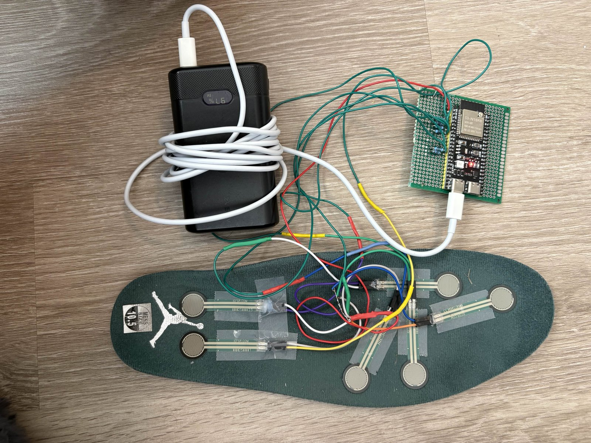
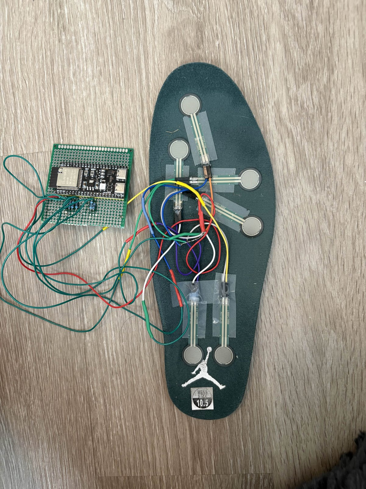
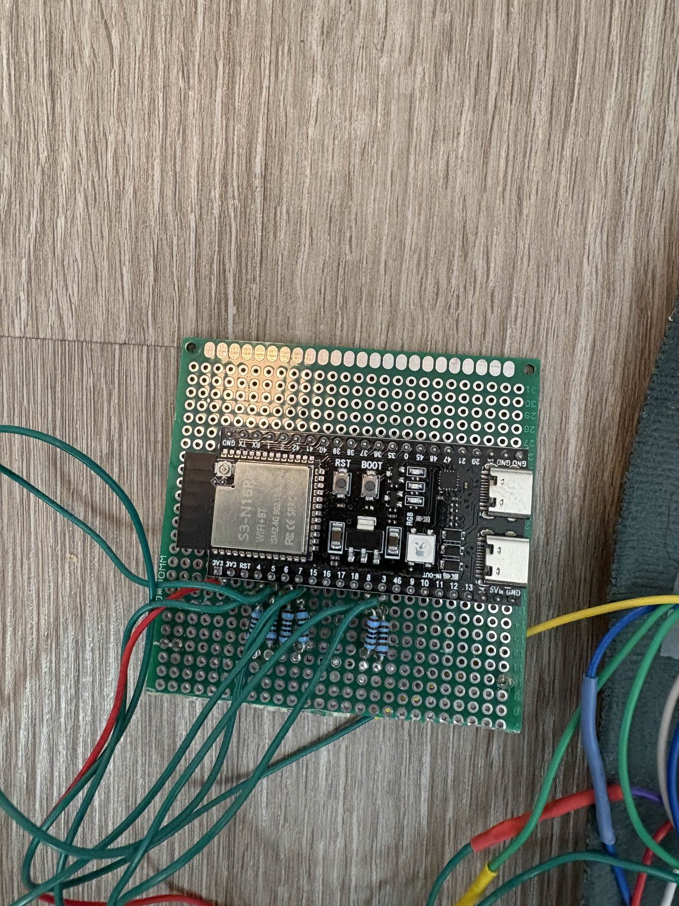

# Insole

A smart insole for gait analysis: six force-sensitive resistors (Interlink FSR
UX 402) under a right insole, sampled at 100 Hz by an ESP32-S3, streamed to a
laptop over USB serial or BLE as checksummed ASCII frames, logged to CSV,
segmented into stances, reduced to per-stance features, and classified by a
from-scratch LDA/QDA. Every stage has a simulator or a stub behind the same
interface as the hardware, so the whole pipeline runs, and is tested, without
a board. Real captures from the board exist for four activities, two sessions
of each, and are the first non-circular test of everything the simulator was
tuned against.

**Start here:** [notebooks/demo.ipynb](notebooks/demo.ipynb) runs the whole
pipeline without hardware, spec to heatmap, in a few seconds, with the real
captures beside the simulated ones; its outputs are committed so it reads on
GitHub. [docs/writeup.md](docs/writeup.md) is the project in about 700
words, and `./run_demo.sh` runs generate → log → predict on the simulator in
one command. For the hardware rather than the code, the
[demo-v1 release](https://github.com/parsaileslamlou/Insole/releases/tag/demo-v1)
carries a recorded walkthrough video and the full-resolution build photos.

## Data path

```
 6x FSR ──1 kΩ dividers──> ESP32-S3 ADC1 (12-bit, 8x oversample, 100 Hz)
                                  │  INS,SEQ,TS_US,S0..S5,CHECKSUM\n
                     ┌────────────┴────────────┐
                USB CDC serial            BLE Nordic UART
                     └────────────┬────────────┘
                                  │  read_serial.make_source()  ── the seam ──┐
  insole/gait_gen.py  (sim)  ─────┤                                            │
  sim_*.txt fixtures         ─────┘                                            │
                                  ▼                                            │
                   FrameValidator: parse, checksum, seq/timing/reset counters   │
                     ┌────────────┴────────────┐                               │
          insole/read_serial.py         insole/infer_live.py                   │
          (CSV logger, exit code)       (one frame at a time)                  │
                     │                          │                              │
                     ▼                          ▼                              │
            detector.find_stances       detector.StanceTracker ─ same state machine
                     │                          │
                     ▼                          ▼
            features.* on the model's rep   features.* per stance ─ bit-identical
                     │                          │
                     ▼                          ▼
            discriminant LDA / QDA      models/model_*.json  ─> prediction per stance

  The detector always sees raw counts. What the FEATURES see is whatever the
  loaded model's meta.representation names (insole/representations.py: A raw,
  B conductance x = counts / (4095 − counts) per channel, C gain-matched
  conductance); infer_live applies that transform and refuses a model whose
  representation it cannot honour, naming both sides. The shipped default is
  B, chosen on the real captures at stage 20 and left standing — a recorded
  decision, not something the file format forces. The gain match
  (models/gain_match.json) is applied per frame in conductance space and,
  under A and B, drives the extrapolation counter only.
```

## Repository layout

| Path | Purpose |
| --- | --- |
| [insole/](insole/) | The package: everything a test or another module imports. `gait_gen` (frame codec + simulator + fault modes), `read_serial` (logger, the transport seam, the validator), `infer_live` (streaming inference), `detector`, `features`, `representations` (what the features see), `splits`, `discriminant`, `calibration`, `fit_calibration`, `heatmap`, `make_sessions`, `paths`. |
| [scripts/](scripts/) | Programs that are run, never imported: `train_real.py` (the real-data classifier and its analysis), `bakeoff.py`, `fit_model.py`, `analyze_real.py`, `sim_vs_real.py`, `sweep_max_duration.py`, `capture_calibration.py`, `compare_captures.py`, `capture_noise.py`, `noise_stats.py`, `bench_capture.sh` (the live bench, recording each run's exit code; needs the board). |
| [tests/](tests/) | Every test. Each runs directly (PASS/FAIL lines, nonzero exit on failure) and under pytest. |
| [notebooks/](notebooks/) | [demo.ipynb](notebooks/demo.ipynb), the run-all demonstration (start here); [insole.ipynb](notebooks/insole.ipynb), the analysis pipeline (Colab-ready). |
| [docs/](docs/) | [writeup.md](docs/writeup.md) (the project in about 700 words), [hardware_notes.md](docs/hardware_notes.md) (board, bench, failure modes, what the live bench showed), [frame_spec.md](docs/frame_spec.md) (the wire contract), [calibration_notes.md](docs/calibration_notes.md), [sim_vs_real.md](docs/sim_vs_real.md), [bakeoff.md](docs/bakeoff.md), [real_results.md](docs/real_results.md). |
| [models/](models/) | `gain_match.json` (single-point relative gain match), `model_lda.json`, `model_qda.json` (sim-trained classifiers), `model_lda_real.json`, `model_qda_real.json` (real captures under B, conductance — `model_qda_real.json` is `infer_live`'s default), `model_lda_real_raw.json`, `model_qda_real_raw.json` (the same fits under A, raw counts). Every model records its own `representation`, and `infer_live` applies the one the model names. |
| [data/real/](data/real/) | Twelve real captures in three sets: `_02` and `_03` (two sessions per class, training/evaluation) and `_01` (failure evidence). Read its README first. |
| [data/sim/](data/sim/) | The five committed simulator fixtures `sim_*.txt`; generated CSVs and sessions land here too and are ignored. |
| [data/bench/](data/bench/) | The stage-14 live bench: the 60 s logger and streamer captures over serial and BLE with their logs, the two stalled BLE attempts, and the press captures that show all six channels live. |
| [cal_data/](cal_data/) | 42 bench calibration captures and their manifest. |
| [figures/](figures/) | Rendered comparison figures, and `hardware/`: photographs of the build. |
| [firmware/insole/](firmware/insole/) | The Arduino sketch and its header. |
| [run_demo.sh](run_demo.sh) | The simulator demo in one command; prints `DEMO OK` or exits nonzero. |

Two invocation forms, used consistently everywhere: package programs run as
`python -m insole.<module>`, scripts run as `python scripts/<name>.py`. Both
resolve repository paths through `insole/paths.py`, never through the working
directory, so they work from anywhere once the package is installed.

## Quickstart (simulator only, no hardware)

Every command below was executed as written. Python 3.10 or newer.

```
git clone https://github.com/parsaileslamlou/Insole.git && cd Insole
python3 -m venv .venv && source .venv/bin/activate      # Windows Git Bash: source .venv/Scripts/activate
pip install -e ".[analysis,test,notebook]"
```

1. Generate a 60 s simulated walk (seeded, so the numbers below reproduce):

   ```
   python -m insole.gait_gen --out demo_walk.txt --noise-seed 1
   wrote demo_walk.txt: 6000 lines, 6000 frames generated
   ```

2. Log it through the validator to a CSV:

   ```
   python -m insole.read_serial demo_walk.txt demo_walk.csv
   source=file valid=6000 malformed=0 empty=0 bad_checksum=0 seq_breaks=0 lost=0 loss=0.00% timing_breaks=0 resets=0 status=0 source_drops=0 capture_s=0.0 device_s=60.0
   ```

3. Stream it through the detector, the features and the persisted classifier:

   ```
   python -m insole.infer_live demo_walk.txt --model models/model_lda.json --label walk --quiet
   model     : models/model_lda.json  kind=lda  classes=['fast', 'shuffle', 'walk']  features=['cop_path_len', 'cop_displacement']
   ...
   features  : representation B (conductance), read from the model's meta and applied on every source; the detector sees raw counts
   ...
   stances completed=60 discarded>MAX_DURATION(200)=0 discarded@reset=0 rejected<MIN_DURATION(15)=0 predicted=60 no_prediction=0 stances_with_gaps=0
   frames extrapolating (any sensor > 824 counts)=3420 (57.0%)  s4=0 frames=2388 (39.8%)  all-zero frames=43
   predictions: fast=6  walk=54
   agreement with --label 'walk': 54/60 = 0.9000  (agreement with a typed label, not an accuracy)
   ```

   The default model is the one trained on the real captures,
   `models/model_qda_real.json` ([docs/real_results.md](docs/real_results.md)).
   This step replays a *simulated* stream, so it names the sim-trained
   `models/model_lda.json`, the model fitted on frames like these. With the
   default model every one of these 60 simulated stances is called `fast`: a
   real-trained model on simulated frames is a plumbing check in the other
   direction, and the banner says so.

4. Build the 12 simulated sessions and the feature frame, and run the bake-off
   (writes `data/sim/features_sessions.csv`; the test suite reads it):

   ```
   python scripts/bakeoff.py
   ```

5. Run the tests (step 4 first: two checks read the frame it builds):

   ```
   python -m pytest -q                 # 49 passed (49 with or without step 4)
   python tests/test_stances.py        # or any one file, for its PASS/FAIL lines (333 across the ten files once step 4 has run; 328 + 2 SKIP before it)
   ```

6. Or do steps 1–3 in one command, deterministic, leaving nothing behind
   (bash; on Windows use Git Bash; `PYTHON=.venv/bin/python` if `python` is
   not the venv's):

   ```
   ./run_demo.sh
   ...
   DEMO OK: 60 stances on a 60 s simulated walk, predictions fast=6  walk=54, 60 rows written
   ```

Both notebooks run from a fresh clone: `jupyter nbconvert --to notebook
--execute notebooks/demo.ipynb` (or `insole.ipynb`) from the repository root,
or open one in Colab (the first cell clones and installs). **Colab caveat:** a
tab opened before a push keeps the old tree when you "Save a copy in GitHub".
Always start from a fresh session.

## Status

| Stage | What | Where | Status |
| --- | --- | --- | --- |
| 1 | Wire-format specification | [docs/frame_spec.md](docs/frame_spec.md) | done |
| 2 | Frame codec + gait simulator | `insole/gait_gen.py` | done |
| 3 | Firmware: six-channel 100 Hz sampler | `firmware/insole/` | done |
| 4 | Host logger, noise-floor utilities | `insole/read_serial.py`, `scripts/capture_noise.py`, `scripts/noise_stats.py` | done |
| 5 | Notebook pipeline: load, clean, window | `notebooks/insole.ipynb` | done |
| 6 | Stance detection | `insole/detector.py` | done |
| 7 | Per-stance features and centre of pressure | `insole/features.py` | done |
| 8 | Pressure heatmap and stance animation | `insole/heatmap.py` | done |
| 9 | Simulator regression fixtures and detector tests | `data/sim/`, `tests/test_stances.py` | done |
| 10 | Multi-session sim data, from-scratch LDA/QDA | `insole/make_sessions.py`, `insole/discriminant.py` | done |
| 11 | Model bake-off | `scripts/bakeoff.py`, [docs/bakeoff.md](docs/bakeoff.md) | done |
| 12 | Calibration: single-point relative gain match | `insole/calibration.py`, `cal_data/`, `models/gain_match.json` | done |
| 13 | Real captures and sim-vs-real analysis | `data/real/`, `scripts/analyze_real.py`, [docs/sim_vs_real.md](docs/sim_vs_real.md) | done; the planned weight-shift activity was not collected |
| 14 | Streaming inference over serial and BLE | `insole/infer_live.py`, firmware BLE | done 2026-09-03; live bench run on the board, four of four captures pass (numbers below) |
| 15 | Fault injection and robustness | `insole/gait_gen.py` fault modes, `tests/test_faults.py` | done |
| 16 | Repository consolidation, this README | package layout | done |
| 17 | Demo notebook | [notebooks/demo.ipynb](notebooks/demo.ipynb), `figures/demo/` | done |
| 18 | Writeup | [docs/writeup.md](docs/writeup.md) | done |
| 19 | Final pass, `run_demo.sh`, hardware notes | [run_demo.sh](run_demo.sh), [docs/hardware_notes.md](docs/hardware_notes.md) | done |
| 20 | Classifier trained on the real captures | `scripts/train_real.py`, [docs/real_results.md](docs/real_results.md) | done; with two sessions per class the headline is leave-one-session-out, every stance tested out of its own session |
| 21 | Second session per class, generalised stance guard, closeout | `data/real/*_03.csv`, `scripts/train_real.py`, `tests/`, this README | done 2026-09-03 |

## Hardware

Bench detail, failure modes and every measurement that is not in a script
are in [docs/hardware_notes.md](docs/hardware_notes.md).

**The build.** Six FSRs taped to a right insole, wired back to an ESP32-S3 on
a perfboard carrier and run off a USB power bank, so the rig is untethered
while walking.



*The assembled rig, powered and ready to walk.*



*The six FSRs in place on the right insole; their measured coordinates are
tabulated under **Sensor placement** below.*



*The ESP32-S3-DevKitC-1 on its carrier, with the divider resistors and the six
sensor leads landing on ADC1.*

Downscaled to 1600 px for this page. The originals, and a recorded walkthrough
video, are attached to the
[demo-v1 release](https://github.com/parsaileslamlou/Insole/releases/tag/demo-v1).

**Board.** ESP32-S3-DevKitC-1 (WROOM-1), Arduino-ESP32 core. The sketch folder
name equals the sketch name (`firmware/insole/insole.ino`). In the Arduino IDE
set *Tools ▸ USB CDC On Boot: Enabled*; without it the board emits nothing on
the USB port. The QT Py ESP32-S3 was evaluated and rejected: it breaks out only
two ADC1 pins, and ADC2 is unusable while the radio is on
([docs/frame_spec.md](docs/frame_spec.md), appendix).

**Pins and dividers.** `PINS = {4, 5, 6, 7, 8, 3}` carry `s0..s5`, all on ADC1
(`firmware/insole/insole.ino`); ADC2 is unusable once BLE is up, which makes
ADC1-only a requirement, not a preference. GPIO3 is a JTAG strapping pin: never
add a pull-up or pull-down to it. Each FSR sits in a divider against 1 kΩ
(`insole/calibration.py`). 12-bit resolution, 8x oversample-and-average per
sample, 100 Hz on an absolute-deadline scheduler, timestamps from
`esp_timer_get_time()` relative to a latched t0.

**Sensor placement** (`insole/detector.py`, `SENSOR_MM`; measured on a right
insole lying top-up, x from the medial edge, y from the heel end; the insole is
274 × 91 mm). Two measurement passes disagreed by 12–22 mm, so every position
carries about ±15 mm, and every centre-of-pressure number inherits it.

| sensor | x (mm) | y (mm) | anatomy |
| --- | --- | --- | --- |
| s0 | 33.0 | 50.8 | heel, medial of the pair |
| s1 | 50.8 | 50.8 | heel, lateral of the pair |
| s2 | 76.2 | 152.4 | lateral midfoot |
| s3 | 81.3 | 185.4 | 5th metatarsal head |
| s4 | 25.4 | 203.2 | 1st metatarsal head |
| s5 | 25.4 | 254.0 | hallux |

**Capture.** Close the Arduino Serial Monitor first (one program per port).
`--port` overrides the default in `insole/read_serial.py`; nothing
machine-local is committed.

```
python -m insole.read_serial --source serial --port COM13 --duration 60 bench_serial.csv
python -m insole.read_serial --source ble --duration 60 bench_ble.csv
python -m insole.infer_live --source serial --port COM13 --duration 60 --out bench_serial_preds.csv
python -m insole.infer_live --source ble --duration 60 --out bench_ble_preds.csv
```

**Pass criteria for the stage-14 live bench:** each 60 s capture reports about
6000 valid frames with `malformed=0 bad_checksum=0 seq_breaks=0
timing_breaks=0 resets=0` over serial, and over BLE `loss` at or under 2 % with
`timing_breaks=0`; every command exits 0; `infer_live` completes stances on
both transports with identical counters to the logger. A stall (`FAIL:
stalled`) means the board went silent for 3 s while the link stayed up. The
firmware prints `# ble ...` status lines once per second; the host counts them
as `status`, not as corruption.

**Live bench, run 2026-09-03 on the board: four of four captures pass.** Right
insole worn, walking (in place or a small figure-8) for the whole of every run;
ESP32-S3 on COM3. Every number below is read from the named log in
`data/bench/`.

| # | run | log | valid | rate | malformed | bad_checksum | seq_breaks | timing_breaks | resets | lost | exit |
| --- | --- | --- | --- | --- | --- | --- | --- | --- | --- | --- | --- |
| 1 | logger, serial | `serial_logger.log` | 6000 | 100.00 Hz | 0 | 0 | 0 | 0 | 0 | 0 (0.00 %) | 0 |
| 2 | logger, BLE | `ble_logger.log` | 6003 | 100.05 Hz | 0 | 0 | 0 | 0 | 0 | 0 (0.00 %) | 0 |
| 3 | `infer_live`, serial | `serial_preds.log` | 6001 | 100.02 Hz | 0 | 0 | 0 | 0 | 0 | 0 (0.00 %) | 0 |
| 4 | `infer_live`, BLE | `ble_preds.log` | 6003 | 100.05 Hz | 0 | 0 | 0 | 0 | 0 | 0 (0.00 %) | 0 |

Both streaming runs completed 33 stances with `predicted=33 no_prediction=0
stances_with_gaps=0`; run 3 printed `shuffle=31 walk=2`, run 4 `shuffle=14
walk=19`. They ran the sim-trained model, which was the default at the time
(the default is the real-trained model now), so those labels on real walking
are not evidence of anything and the bench does not grade them. Run 2's
sequence numbers are contiguous across all 6003 frames. Exit codes are not
printed in the logs; they follow from the counters through
`read_serial.exit_code`, which returns 0 for all four, and the CSVs were
re-checked offline for sequence and timing continuity (zero breaks).

All six channels are live. The press captures reach s0 1789, s1 1769, s2 1786,
s3 1746 (`press.csv`) and s4 1953, s5 1661 (`press_medial.csv`, which presses
the two medial pads in a known order with a gap between them so each is
attributed unambiguously — the first sweep missed s5 by pressing the wrong pad,
which looks identical to a dead channel). Both logger runs show all six active
through the walk, s4 lowest at 26–27 % of frames, as its activation threshold
predicts.

**The BLE runs completed only with the board on battery.** Two BLE attempts
with the board powered from this PC's USB cable stalled identically: connected
in 0.7–1.3 s at MTU 517, then the firmware counters showed `notif=7` (21
frames) and `disc=1` roughly 210 ms after `requestConnParams`, while the host
recorded `valid=1` and `FAIL: stalled` (`ble_logger_attempt1_stalled.log`,
`ble_logger_attempt2_stalled.log`; firmware counters in
`ble_diag_after_stall.log` and `ble_diag_after_stall2.log`). The board was not
the fault: between attempts it logged `valid=601` over serial with every
counter zero, and the `conns`/`disc` counters it prints exist only in firmware
at or after the connection-parameter fix, so the reflash this symptom is
otherwise diagnostic of does not apply. Three things changed before the passing
attempt — Windows Bluetooth toggled off and on, the phone's Bluetooth disabled,
and the board moved to a USB power bank — so the cause is narrowed to the
Windows-side central but **not isolated**.

**Calibration.** `models/gain_match.json` is a *single-point relative gain
match*: the six channels' gains matched to their mean at one ~12 N load after
a ≥ 35 min rest, applied in conductance space `x = counts / (4095 − counts)`.
It is not an absolute force calibration, and it never reaches the classifier:
the features see plain conductance (variant B, `insole/representations.py`),
the gain match is applied per frame only to drive the extrapolation counter. Derivation and limitations are in
[docs/calibration_notes.md](docs/calibration_notes.md); regenerate with
`python -m insole.fit_calibration` (reads `cal_data/calibration_manifest.csv`,
writes `models/gain_match.json`). The highest count any calibration sample
reached is 824 (`calibration.CAL_MAX_COUNTS`, checked against `cal_data/` by
the tests), and loaded walking frames sit above it 62–67 % of the time
(`scripts/analyze_real.py` C3): reported, never clamped.

## Fault handling

`insole/gait_gen.py` can inject three link faults into any simulated stream, so
the logger and the streamer are exercised against a misbehaving link without a
board. All three are off by default and the generator is byte-identical with
them off (`tests/test_faults.py` pins the twelve session hashes).

```
python -m insole.gait_gen --out faulty.txt --drop-rate 0.01 --corrupt-rate 0.005 --reset-at 30 --fault-seed 1
python -m insole.read_serial faulty.txt faulty.csv      # counters, exit 1
python -m insole.infer_live faulty.txt                  # stances flagged, exit 1
```

| fault (flag) | what the wire carries | logger (`insole/read_serial.py`) | streamer (`insole/infer_live.py`) | counter | test |
| --- | --- | --- | --- | --- | --- |
| frame lost (`--drop-rate`) | a sequence gap | drop and count; no row written, nothing reconstructed | same counters; a stance whose span contains a gap is flagged with `gap_frames` beside its prediction and in `--out`; features use the frames that arrived | `lost`, `seq_breaks` | `tests/test_faults.py::test_drop_mode` |
| bad checksum (`--corrupt-rate`) | a well-formed frame with the wrong checksum | drop and count; the frame consumed a sequence slot, so its gap is credited to `bad_checksum`, not counted a second time as loss | same; the stance is one frame shorter and flagged | `bad_checksum` | `tests/test_faults.py::test_corrupt_mode` |
| board reset (`--reset-at`) | boot text, then `SEQ` and `ts_us` restart at 0 | count once; re-seed the sequence and timing validators from the first post-reset frame; not also a seq break, loss or timing break | same; the stance in progress is discarded (its end is unobservable), a complete pending stance is released, the running-median dt and the frame buffer are cleared, later stances carry the next `epoch` | `resets` | `tests/test_faults.py::test_reset_mode` |

Both consumers run the same `read_serial.FrameValidator`, and
`tests/test_faults.py::test_logger_streamer_consistency` feeds one stream
carrying all three faults to both, over a file and over the fake serial
source, and asserts identical counters. The accounting identity it checks is
`valid + lost + bad_checksum == frames the board emitted`, up to frames lost
right at a reset boundary, which no host can see. Sensor values are never
imputed, which is the same rule as for s4's below-threshold zeros.

Exit code under injected faults: `malformed`, `bad_checksum` or `empty` fail
on every transport; `lost`, `seq_breaks` or `timing_breaks` fail on file and
serial, while BLE tolerates up to 2 % loss; `resets` fails on every transport,
because a reboot mid-capture leaves a file whose time axis restarts, and over
native USB CDC or BLE the boot text never reaches the host, so the clock is
the only evidence.

What real hardware can still do that this does not anticipate: well-formed
frames carrying wrong physics (an intermittent channel as in the `_01`
captures, the single-frame correlated dips, FSR relaxation drift); a BLE link
left half-open, where notifications stop without a disconnect and only the
inactivity watchdog sees the symptom; and a brownout on battery, which is a
reset the host may never get a frame from.

## Results

Every number here is printed by the named script; regenerate before quoting.

**Simulated bake-off** (`python scripts/bakeoff.py`; [docs/bakeoff.md](docs/bakeoff.md)).
Two CoP features only, features under representation B, session-disjoint
split, 270 held-out stances, majority floor 0.4296. Logistic regression
0.9185, LDA 0.9185, QDA 0.9296, Wilson 95 % intervals in the doc. The three
models' fast→walk errors are 7 / 5 / 5 rows with 4 in common. Simulated data is
not evidence about hardware: the generator's constants, the detector
thresholds and the tests over them were co-evolved, so this result is
internally consistent by construction.

**Sim-trained model on the real captures** (`python scripts/train_real.py`,
section 9). On the 224 real moving stances of both sessions (walk 67, fast 93,
shuffle 64) the sim-trained LDA scores 0.3795 and QDA 0.3438, below the 0.4152
majority floor; on the `_02` set alone (`python scripts/sim_vs_real.py`, D2)
0.3097 and 0.2566 against 0.4248. That is the expected outcome for a model
fitted on a simulator, and it is a plumbing check, not a classifier result.

**Classifier trained on the real captures** (`python scripts/train_real.py`;
[docs/real_results.md](docs/real_results.md), every number regenerated by
the script). Two sessions per class on two days, so the split is
leave-one-session-out: fold k holds out session k of every class, every stance
is tested once out of its own session, and the headline pools the two folds.
Headline, chosen by a rule fixed before any result was seen (CoP-only
features; the representation and model, LDA or QDA, with the best pooled
leave-one-session-out accuracy): **representation A (raw counts), QDA,
0.6071 [0.5419, 0.6688] (136/224)** against a 0.4152 floor, folds 0.6195 and
0.5946. **That cell is not what this repository ships.** The shipped default
is representation B (conductance); the same cell under B scores 0.5982
[0.5329, 0.6602] (134/224), and B's is the number a clone of this repository
reproduces as it stands. 0.6071 is reachable only by loading the A-fitted
models (`models/model_qda_real_raw.json`), never from the shipped default.

> **The pooled interval is a LOWER BOUND on the uncertainty, not a confidence
> interval for a new session.** It is a Wilson interval computed as if the 224
> pooled stances were 224 independent observations. They are not. They are 224
> stances drawn from 2 sessions of 1 subject, and stances within one session
> share the subject, the day, the shoe, the sensor seating and the figure-8
> path, so they are positively correlated; the effective number of independent
> observations is nearer the number of sessions than the number of stances.
> Treating correlated observations as independent understates the variance, so
> the true interval is WIDER than the one printed, by an amount this data cannot
> quantify: correcting it needs the between-session variance, and 2 sessions
> estimate that from 2 points (1 degree of freedom), which is not an estimate.
> The per-fold intervals are reported beside the pooled one for exactly this
> reason: they are the widest honest statement available here. Read the pooled
> interval as the floor of the uncertainty, never as its extent. This applies to
> every pooled interval quoted below and in
> [docs/real_results.md](docs/real_results.md).

**The shipped number is 0.5982 [0.5329, 0.6602] (134/224)**: the same cell
under representation B (conductance), the representation the streaming path
feeds and `models/model_qda_real.json` is fitted on, two stances from A's.
Walk recall is 0.209: 39 of the 67 walk stances are called fast, which is the
fast-versus-walk confusion the simulator predicted for CoP features once
cadence is removed, now confirmed on hardware; shuffle is what the CoP
separates. The within-session time-blocked split, the previous headline
recipe, gives 0.6667 on the same cell, so a session boundary costs about six
points here. With all seven features (contact time and its relatives
included) the best cell reaches 0.7578 [0.6976, 0.8094] (169/223) out of
session, riding on cadence.

> **The two headline numbers are on different denominators: the CoP-only 0.6071
> (representation A, raw counts; B is 0.5982 on the same 224) is on n = 224, the
> full-feature 0.7578 on n = 223.** One stance (`shuffle_03`
> at t = 0.00 s) begins at the first frame of its capture, so it has no pre-onset
> frames, `loading_rate_cps` is undefined there and `features.py` returns NaN
> rather than imputing a value. Any cell whose feature set includes that feature
> drops the stance from both sides of the split; the CoP-only cells do not use it
> and keep it. The stance is named and dropped, never filled in. Differencing
> 0.6071 and 0.7578 compares two accuracies measured on test sets that are not
> the same set.

The doc lists every misclassified stance, measures the s4-zero and gain-match
effects on the CoP in millimetres, and checks peak force against onset time
under a family-wise correction over all nine regressions run.

**Real captures through the pipeline** (`python scripts/analyze_real.py`;
[docs/sim_vs_real.md](docs/sim_vs_real.md), the stage-13 record, on the `_02`
set). Stances at the committed thresholds: stand 0, walk 35, fast 48, shuffle
30 for `_02` and 0, 32, 45, 34 for `_03` (`tests/test_stances.py` pins all
eight; `scripts/train_real.py` refuses a capture that is not pinned). s4 reads
0 on 52–56 % of moving frames because it has the highest
activation threshold of the six; on those frames the CoP is a five-sensor
centroid biased laterally by 33.6–36.7 mm against a 91 mm width. The stance
detector's `MAX_DURATION` was raised from 120 to 200 on this data
(`python scripts/sweep_max_duration.py`): at 120 it discarded 17 of 35 walk and
28 of 30 shuffle contacts outright, because real contacts here run 84–164
frames while no simulated stance exceeds 60.

## Analysis notebook

[notebooks/insole.ipynb](notebooks/insole.ipynb) runs on the saved CSVs and is
written for Colab; its first cell clones the repository, installs the package,
and rebuilds the simulated CSVs from the committed streams. Locally, execute it
from the repository root. Stages: load and clean (with `ts_us` exactly as the
firmware recorded it; an earlier version overwrote it with the sample index,
which hid timing jitter and was caught only when real data arrived), window,
stance detection, scoring against `gait_gen.true_stances`, features, and the
walk-versus-fast feature plots. The pressure heatmap between the six sensors
is inverse-distance-weighted interpolation, not measurement, and the render
says so.

## Tests

```
python -m pytest -q                 # everything, from the repository root (49 functions)
python tests/test_faults.py         # or any one file, for its PASS/FAIL lines
```

| File | Guards | PASS lines |
| --- | --- | --- |
| [tests/test_stances.py](tests/test_stances.py) | Detector counts against `gait_gen.true_stances` on the five sim streams; `merge_close`; the real stance counts, `_02` 0 / 35 / 48 / 30 and `_03` 0 / 32 / 45 / 34. | 23 |
| [tests/test_geometry.py](tests/test_geometry.py) | `SENSOR_COORDS` derived from `SENSOR_MM`; closed-form CoP answers; the documented all-zero `(nan, nan)`. | 51 |
| [tests/test_calibration.py](tests/test_calibration.py) | Force fit recovery, flags, saturation; the gain match multiplies conductance, not counts; the six shipped corrections. | 55 |
| [tests/test_capture_window.py](tests/test_capture_window.py) | The capture window is anchored on the first line, not process start. | 13 |
| [tests/test_discriminant.py](tests/test_discriminant.py) | LDA/QDA against sklearn; Wilson interval; weighted pooled covariance; the `n_k <= p` guard. | 7 |
| [tests/test_infer_live.py](tests/test_infer_live.py) | Streaming == batch features on every capture; read boundaries; malformed frames; all-zero frames; `MAX_DURATION` discards; file/serial/BLE parity; no state leaks; the stall watchdog; the model's representation drives the feature path and an unhonourable one is refused. | 81 |
| [tests/test_faults.py](tests/test_faults.py) | The three fault modes through logger and streamer; byte identity with faults off; the accounting identity; the CLI. | 55 |
| [tests/test_parse_frame.py](tests/test_parse_frame.py) | The frame codec's rejection paths (frame spec section 8). | 9 |
| [tests/test_ble_transport.py](tests/test_ble_transport.py) | The BLE reader thread's failure reaches the consumer rather than being swallowed; batched notification arrival is not counted as a broken sample clock. Needs no radio and never imports `bleak`. | 2 |
| [tests/test_train_real.py](tests/test_train_real.py) | The splits (no overlap, order, sizes, contiguous blocks); leave-one-session-out on the two sessions (two folds, every stance once, no session on both sides, the per-fold class counts); identity gains make C equal B; the shipped representation reproduces the bake-off frame and raw counts still give the pre-switch figure; `scripts/train_real.py` end to end, with the split the data on disk allows. | 37 |

Every file's checks print PASS/FAIL lines and return their counts; the
`test_*` wrappers pytest collects assert that nothing failed, so a red check
fails pytest too. The PASS-line column above is the count once
`scripts/bakeoff.py` has run.

**The two counts move independently, and only the script-suite one moves.**
`tests/test_infer_live.py` and `tests/test_train_real.py` read
`data/sim/features_sessions.csv`, which `scripts/bakeoff.py` builds and
`.gitignore` excludes. Without it each file prints one `SKIP` line naming the
command that produces it, and a skipped check counts as neither a pass nor a
failure. The two `SKIP` lines are script-suite checks, not pytest tests:
pytest collects 49 functions and passes 49 either way, because the wrappers
assert only that nothing *failed*.

| Run directly (`python tests/test_*.py`) | Fresh clone | After `python scripts/bakeoff.py` |
| --- | --- | --- |
| `tests/test_infer_live.py` | 80 PASS, 1 SKIP | 81 PASS |
| `tests/test_train_real.py` | 33 PASS, 1 SKIP | 37 PASS |
| the other eight files | 215 PASS | 215 PASS |
| **total** | **328 PASS, 0 FAIL, 2 SKIP** | **333 PASS, 0 FAIL, 0 SKIP** |
| `python -m pytest -q` | 49 passed | 49 passed |

The two `SKIP` lines gate five checks between them, not two: the
`test_train_real.py` skip stands in front of four. `scripts/fit_model.py` is
not needed for either — `models/model_lda.json` is committed — so
`python scripts/bakeoff.py` alone takes a fresh clone from 328 to 333.
**A fresh clone is green before anything is generated**, and a missing
generated artifact and a real failure are not reported as the same thing.

## Closing state

This section is final. The three lists below replace the open-items list:
what this project accepts and will not fix, what has since been resolved, and
what is still parked on another machine. None of them is a to-do list.

### Accepted limitations

Each of these is understood, measured where it can be measured, and left as
it stands. The sentence after each says why it is accepted rather than fixed.

- **The 2026-09-03 bench exit codes were derived, not recorded.** The four
  runs were typed by hand and their logs end at `read_serial`'s summary line,
  so the `exit` column was reconstructed by feeding each log's counters back
  through `read_serial.exit_code` (a pure function of those counters, 0 for
  all four); it cannot see an exception, a signal, or a failed write after the
  summary printed (`docs/hardware_notes.md`). *Accepted because re-recording
  them means re-running the bench on hardware, and the reconstruction is sound
  for everything the counters describe — `bench_capture.sh` now records the
  status directly, so the gap is closed forward and only these four runs carry
  it.*
- **BLE stalls when the board is powered from the host PC's USB cable.** The
  stage-14 bench passed on all four runs, but the BLE two only on battery; two
  attempts on PC power dropped the link ~210 ms after the connection-parameter
  request. Three variables changed before the passing run, so the cause is
  narrowed to the Windows-side central, not identified. *Accepted because
  isolating it needs a second central and a protocol capture on hardware this
  project no longer has time on, and a battery is a complete workaround for
  the only use the insole has.*
- **Detector thresholds are simulator-swept.** `T_ON`, `T_OFF`,
  `MIN_DURATION` and `GAP_MERGE` were chosen against streams whose constants
  were co-evolved with them; only `MAX_DURATION` was set from real data.
  *Accepted because re-sweeping them honestly needs labelled real stances from
  more than one subject, which this dataset cannot supply — and the circularity
  is disclosed rather than hidden, which is the most this data supports.*
- **One subject, two sessions per class.** Two sessions is the minimum that
  makes a per-session split possible, not a comfortable margin: with two folds
  one odd session moves the number a lot, and it is still one subject on one
  figure-8 path. Weight-shift was never collected, although the collection plan
  listed it. *Accepted because the fix is a data-collection campaign, not a code
  change, and every number in this repository is already reported against the
  session-disjoint split with its denominator named.*
- **The calibration gain match never reaches the classifier.** The features see
  conductance (representation B); the gain-matched representation C scores the
  same as B on the two-session data (0.5982 both) while extrapolating above 824
  counts on most loaded walking frames, and does not hold below about 5 N.
  *Accepted because shipping C would be a default change plus a refit for a
  move of at most two stances in 224 — a change this data cannot show to be an
  improvement — so the gain match drives the extrapolation counter only.*
- **Every pooled interval is a lower bound on the uncertainty, not a
  confidence interval for a new session.** The Wilson intervals treat 224
  stances from 2 sessions of 1 subject as 224 independent observations; they
  are positively correlated, so the true interval is wider. *Accepted because
  correcting it needs the between-session variance, and two sessions estimate
  that from two points — one degree of freedom, which is not an estimate; the
  per-fold intervals are reported beside every pooled one for exactly this
  reason.*
- **The pre-registered rule now prefers raw counts, by a margin finer than the
  data it is deciding on.** It picks A (raw) over B (conductance) by two
  stances in 224 — 0.9 % — and the two cells' Wilson intervals, [0.5419,
  0.6688] for A and [0.5329, 0.6602] for B, overlap over 93 % of their length.
  **A and B are statistically indistinguishable on this data. B remains
  shipped and is FROZEN**, retained as a pre-existing freeze taken at stage 20,
  not as this rule's verdict — any statement that the rule selected B is wrong.
  *Accepted because switching the shipped representation moves the sim bake-off
  frame, the sim-trained models and the streaming path together, for a change
  this data cannot show to be an improvement.*
- **s4's activation threshold makes the CoP a five-sensor centroid.** Over all
  moving frames of the `_02` captures s4 reads 0 on 46–56 % of them, a
  common-substitute bias of 33.6–36.7 mm (`scripts/analyze_real.py` C4/C4b);
  inside kept stances it is 20–35 % of frames and a 12–14 mm shift
  (`docs/real_results.md` section 7). Its zeros are below-threshold readings,
  never imputed or dropped. *Accepted because it is a property of the sensor at
  low load, not a bug in the pipeline, and the cost is measured in millimetres
  in two places rather than corrected away.*
- **Sensor coordinates carry ±15 mm** on a 91 mm wide insole. *Accepted because
  tightening them needs a jig and a rebuild of the insole, and the figure is
  quoted beside every CoP number rather than dropped.*
- **Firmware, left as is:** `Serial.printf` from core 0 can interleave with
  frame writes from core 1 (rare, MTU transition only); the BLE gather loop's
  size-guard discard neither increments `bleDropped` nor advances the cursor.
  *Accepted because neither can trigger at current frame sizes, and both are
  recorded here rather than patched blind on a board that is no longer on the
  bench.*
- **`force_n` / `sigma_F` in the calibration manifest** bake estimator choices
  (g = 9.81, range/√12) into an append-only file, and the recorded ~2 % force
  uncertainty understates the real one: the operator reading the scale
  dominates. *Accepted because the file is append-only by design and the raw
  counts it derives from are all still there, so a better estimator can be
  applied downstream without rewriting the manifest.*

### Resolved

Both branches that were parked on the other machine have been swept. Neither
is on this remote; both are archived in a local git bundle,
`insole_archive_branches.bundle`, which `git bundle verify` reports as
carrying their complete history.

- **`cal-wls-local` — evaluated and rejected.** Its `1/sigma_x^2`-weighted
  calibration fit was measured against the shipped unweighted OLS fit and not
  adopted: it shifts the fitted slope 2.5–7.1 % on five of six channels,
  changes no `MIN_R2` flag (every channel the shipped fit marks `poor_fit`
  stays `poor_fit`), and the information ratio that motivates it is 1.9–2.3x
  on the captures that exist rather than the 19.9x quoted for a hypothetical
  load ladder. Both estimators, and the reasoning, are written up in
  `docs/calibration_notes.md`.
- **`wip/ble-transport` — landed.** Its BLE reader-thread failure fix is now
  in `insole/read_serial.py`: the reader's exception is parked and re-raised in
  the consumer once every queued line has been yielded, so a dead radio
  produces a traceback and a nonzero exit instead of a short capture that looks
  clean. `tests/test_ble_transport.py` came with it and covers both that path
  and the batched-arrival timing check.
