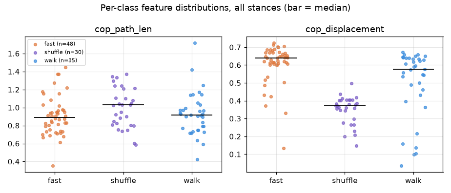
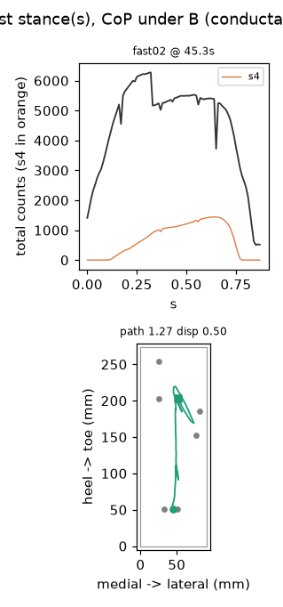
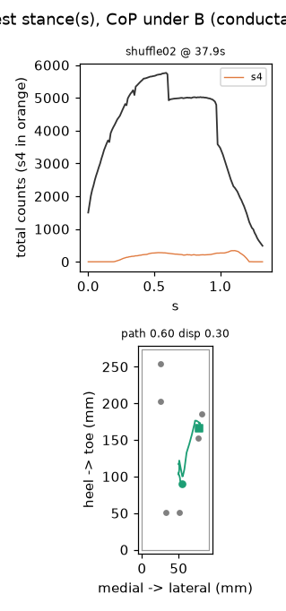
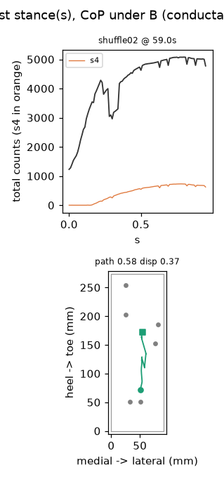
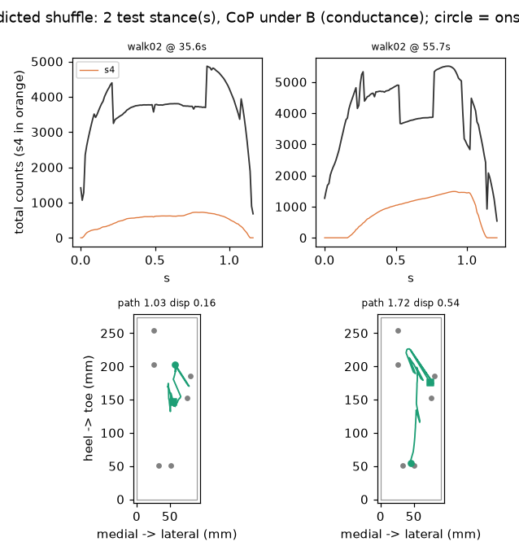
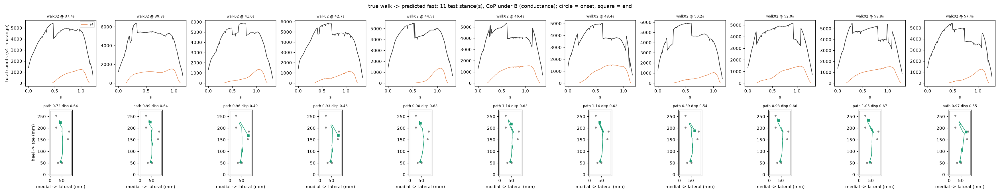
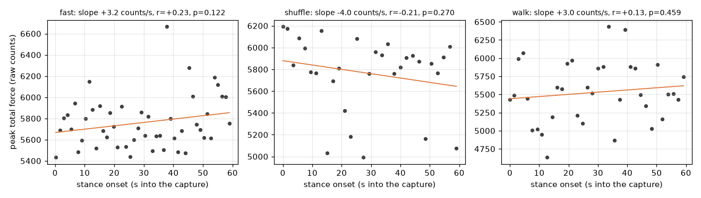

# Real-data results

Every number in this file is written by `python scripts/train_real.py` (git a7a803b); regenerate it, do not edit it. Figures: `figures/real_results/`. Models: `models/model_lda_real.json`, `models/model_qda_real.json`.

## 1. Data

The `_02` captures only (`data/real/README.md`): one 60 s session per activity, 100 Hz, tethered USB, one subject, one day, walking a figure-8. `_01` is failure evidence and is never trained or evaluated on. Segmentation uses `insole/detector.py` at the committed thresholds (T_ON=1200, T_OFF=450, MIN_DURATION=15, MAX_DURATION=200, GAP_MERGE=12) on raw counts, and the counts are asserted against `tests/test_stances.py`:

| activity | file | frames | stances kept |
|---|---|---|---|
| stand | `stand_02.csv` | 6000 | 0 |
| walk | `walk02.csv` | 6000 | 35 |
| fast | `fast02.csv` | 6000 | 48 |
| shuffle | `shuffle02.csv` | 6000 | 30 |

Standing is one unbroken 6000-frame contact, rejected by MAX_DURATION, so it contributes no stances and is excluded from classification. n = 113 moving stances (fast 48, shuffle 30, walk 35); the all-data majority floor is 0.4248.

## 2. Representations and feature sets

Features are `insole/features.py`'s extractors, unchanged, computed on three per-frame input representations (`insole/representations.py`); the detector always runs on raw counts:

- **A raw**: the six ADC counts as logged.
- **B conductance**: x = counts / (4095 − counts) per channel; x(0) = 0.
- **C gain-matched**: x · g, g from `models/gain_match.json` (s0=0.9900, s1=0.9616, s2=0.9741, s3=1.2513, s4=0.8692, s5=0.9538).

Force is linear in conductance (`insole/calibration.py`), so under B and C the centre of pressure is a force-proportional centroid and under A it is not. The gain match is a single-point relative match at ~12 N: above 824 counts (62–67 % of loaded walking frames, `scripts/analyze_real.py` C3) it extrapolates, and below ~5 N the channels' activation thresholds differ, so it does not hold there.

**Shipped representation: B (conductance)** -- `insole.representations.SHIPPED`, the one `insole/infer_live.py` feeds on every source, `scripts/bakeoff.py` builds the sim frame under, and the persisted models are fitted on. It was chosen by the headline rule in section 4 (block-CV, CoP-only, LDA/QDA: A 0.6195, B 0.6372, C 0.6283). The simulator has no per-channel gain to correct, so under B every source is treated identically; the gain match still runs per frame for the extrapolation counter.

Two feature sets: **cop** = `cop_path_len`, `cop_displacement` (exactly the set `scripts/bakeoff.py` used, for comparability with the simulator), and **full** = all seven (`peak_counts`, `time_to_peak_s`, `contact_time_s`, `loading_rate_cps`, `impulse_counts_s` plus the two CoP features). The sim bake-off excluded the five timing/magnitude features because simulated fast and walk differ only in cadence, so any cadence feature reads the label off the generator. On real data cadence is measured, not constructed, so the full set is a legitimate classifier here, but it is not comparable with the sim number. Under B and C the count-valued features are in conductance units and keep their column names.

## 3. Split

**time-blocked within each session: first 60% of stances train, last 40% test, guard band 0.** There is one session per class, so no per-session split exists. Stances are sorted by onset within each session; the earlier ones train and the later ones test. This is a within-session number and carries the leakage that implies: consecutive stances of one walk share the subject, the day, the shoe, the path and the sensor state. Do not read it as generalisation to a new session.

| class | train | test | dropped (guard) |
|---|---|---|---|
| fast | 29 | 19 | 0 |
| shuffle | 18 | 12 | 0 |
| walk | 21 | 14 | 0 |

n_train = 68, n_test = 45, test majority floor = 0.4222 (19/45, always `fast`).

Two further splits are reported beside it so the optimism gap is visible: a **random stance-level split** with the same per-class sizes, 20 seeds (mean, min, max), which puts near-copies of every test stance into training and is expected to be optimistic; and **contiguous-block cross-validation**, 5 time blocks per class, each block held out once, which tests every stance exactly once with its own block out of training.

## 4. Results grid

Accuracy on the time-blocked test set with a Wilson 95 % interval and the count, then the block-CV pooled accuracy, then the random-split mean [min, max]. LDA/QDA are `insole/discriminant.py`; LR is sklearn's `LogisticRegression` on standardised features, as in `scripts/bakeoff.py`. A skipped cell says why.

| rep | features | model | time-blocked acc [Wilson 95 %] | block-CV | random split |
|---|---|---|---|---|---|
| A | cop | lda | 0.6000 [0.4545, 0.7298] (27/45) | 0.6018 | 0.6067 [0.4667, 0.6889] |
| A | cop | qda | 0.6444 [0.4984, 0.7678] (29/45) | 0.6195 | 0.6333 [0.5333, 0.7111] |
| A | cop | lr | 0.6000 [0.4545, 0.7298] (27/45) | 0.5841 | 0.6011 [0.4889, 0.6889] |
| A | full | lda | 0.8889 [0.7650, 0.9516] (40/45) | 0.8850 | 0.8656 [0.8000, 0.9333] |
| A | full | qda | 0.8222 [0.6867, 0.9071] (37/45) | 0.8850 | 0.8600 [0.7556, 0.9778] |
| A | full | lr | 0.8667 [0.7382, 0.9374] (39/45) | 0.8407 | 0.8500 [0.7778, 0.9111] |
| B | cop | lda | 0.5778 [0.4330, 0.7103] (26/45) | 0.5752 | 0.5933 [0.4889, 0.6889] |
| B | cop | qda | 0.6444 [0.4984, 0.7678] (29/45) **(headline)** | 0.6372 | 0.6433 [0.5556, 0.7333] |
| B | cop | lr | 0.5778 [0.4330, 0.7103] (26/45) | 0.5841 | 0.5900 [0.4667, 0.6889] |
| B | full | lda | 0.8889 [0.7650, 0.9516] (40/45) | 0.8673 | 0.8622 [0.8000, 0.9333] |
| B | full | qda | 0.8444 [0.7122, 0.9225] (38/45) | 0.8584 | 0.8356 [0.7556, 0.9556] |
| B | full | lr | 0.9111 [0.7927, 0.9649] (41/45) | 0.8584 | 0.8533 [0.8000, 0.9333] |
| C | cop | lda | 0.5778 [0.4330, 0.7103] (26/45) | 0.5664 | 0.5867 [0.4667, 0.6889] |
| C | cop | qda | 0.6444 [0.4984, 0.7678] (29/45) | 0.6283 | 0.6256 [0.5333, 0.7111] |
| C | cop | lr | 0.5778 [0.4330, 0.7103] (26/45) | 0.5664 | 0.5822 [0.4667, 0.6667] |
| C | full | lda | 0.8889 [0.7650, 0.9516] (40/45) | 0.8673 | 0.8644 [0.8000, 0.9333] |
| C | full | qda | 0.8667 [0.7382, 0.9374] (39/45) | 0.8496 | 0.8278 [0.7333, 0.9333] |
| C | full | lr | 0.9111 [0.7927, 0.9649] (41/45) | 0.8673 | 0.8533 [0.8000, 0.9333] |

### Headline

Rule, fixed before any result was seen: CoP-only features; among LDA and QDA under A, B and C, the cell with the best block-CV accuracy; ties go to raw counts and to LDA. That is **B (conductance), cop, QDA**: time-blocked accuracy **0.6444** [0.4984, 0.7678] (29/45) against a test floor of 0.4222; block-CV 0.6372 (folds 0.565, 0.609, 0.696, 0.591, 0.727); random split 0.6433 [0.5556, 0.7333]. The gap between the random-split mean and the time-blocked number is the optimism that temporal adjacency buys on this data: -0.0011.

With a one-stance guard band between the training and test blocks (training loses its last stance per class) the same cell scores 0.6222 [0.4763, 0.7489] (28/45).

The best full-feature cell is B full lr at 0.9111 [0.7927, 0.9649] (41/45) (block-CV 0.8584). It is the better classifier of these activities and it is reported here as such, but it rides on `contact_time_s` and its relatives, whose class medians on this data are fast 0.79 s, shuffle 1.40 s, walk 1.18 s, i.e. on cadence; it is not comparable with the sim bake-off and does not test the CoP features.

Confusion matrix of the headline cell (rows true, columns predicted, order fast, shuffle, walk):

| | fast | shuffle | walk | recall |
|---|---|---|---|---|
| **fast** | 18 | 1 | 0 | 0.947 |
| **shuffle** | 1 | 10 | 1 | 0.833 |
| **walk** | 11 | 2 | 1 | 0.071 |
| precision | 0.600 | 0.769 | 0.500 | |

Per-class recall fast 0.947, shuffle 0.833, walk 0.071: the headline's accuracy comes from the other classes; walk test stances are called fast 11 times out of 14. The table below shows why a time-blocked split does that -- the training block and the test block of one session are not the same distribution:

| feature | class | train block mean | test block mean | shift in test-block sd |
|---|---|---|---|---|
| cop_path_len | fast | 0.8674 | 0.9667 | +0.49 |
| cop_path_len | shuffle | 1.0152 | 0.9667 | -0.19 |
| cop_path_len | walk | 0.8893 | 0.9861 | +0.35 |
| cop_displacement | fast | 0.5916 | 0.6267 | +0.50 |
| cop_displacement | shuffle | 0.3458 | 0.3538 | +0.12 |
| cop_displacement | walk | 0.4798 | 0.5318 | +0.33 |

McNemar, QDA vs LDA on the same test set: b = 5, c = 2, exact two-sided p = 0.4531; the smallest p attainable at b + c = 7 is 0.0156.

## 5. Per-class feature distributions (headline cell)

| feature | class | n | mean | sd | min | median | max |
|---|---|---|---|---|---|---|---|
| cop_path_len | fast | 48 | 0.9067 | 0.2123 | 0.3514 | 0.8913 | 1.4477 |
| cop_path_len | shuffle | 30 | 0.9958 | 0.2218 | 0.5839 | 1.0299 | 1.3719 |
| cop_path_len | walk | 35 | 0.9280 | 0.2400 | 0.4243 | 0.9147 | 1.7194 |
| cop_displacement | fast | 48 | 0.6055 | 0.1108 | 0.1333 | 0.6392 | 0.7248 |
| cop_displacement | shuffle | 30 | 0.3490 | 0.0789 | 0.1481 | 0.3706 | 0.4962 |
| cop_displacement | walk | 35 | 0.5006 | 0.1905 | 0.0347 | 0.5768 | 0.6727 |

Fraction of each class's stances (all of them) that fall inside another class's p10–p90 training band, per feature. High values are the overlap the classifier cannot resolve:

| feature | class | inside fast band | inside shuffle band | inside walk band |
|---|---|---|---|---|
| cop_path_len | fast | — | 0.67 | 0.73 |
| cop_path_len | shuffle | 0.67 | — | 0.67 |
| cop_path_len | walk | 0.80 | 0.69 | — |
| cop_displacement | fast | — | 0.04 | 0.65 |
| cop_displacement | shuffle | 0.10 | — | 1.00 |
| cop_displacement | walk | 0.77 | 0.06 | — |

## 6. Every misclassified test stance

| session | onset (s) | true | predicted | cop_path_len | cop_displacement | contact_time_s | s4 = 0 frames |
|---|---|---|---|---|---|---|---|
| fast02 | 45.31 | fast | shuffle | 1.2739 | 0.5022 | 0.87 | 23% |
| shuffle02 | 37.85 | shuffle | walk | 0.6004 | 0.2969 | 1.32 | 22% |
| shuffle02 | 59.04 | shuffle | fast | 0.5839 | 0.3706 | 0.95 | 14% |
| walk02 | 35.58 | walk | shuffle | 1.0315 | 0.1596 | 1.16 | 4% |
| walk02 | 37.44 | walk | fast | 0.7163 | 0.6351 | 1.23 | 42% |
| walk02 | 39.26 | walk | fast | 0.9928 | 0.6431 | 1.16 | 15% |
| walk02 | 40.97 | walk | fast | 0.9621 | 0.4888 | 1.34 | 33% |
| walk02 | 42.73 | walk | fast | 0.9278 | 0.4617 | 1.35 | 33% |
| walk02 | 44.55 | walk | fast | 0.9026 | 0.6339 | 1.31 | 49% |
| walk02 | 46.36 | walk | fast | 1.1428 | 0.6273 | 1.36 | 18% |
| walk02 | 48.35 | walk | fast | 1.1412 | 0.6222 | 1.16 | 21% |
| walk02 | 50.20 | walk | fast | 0.8948 | 0.5436 | 1.16 | 26% |
| walk02 | 51.97 | walk | fast | 0.9289 | 0.6583 | 1.31 | 15% |
| walk02 | 53.83 | walk | fast | 1.0501 | 0.6727 | 1.29 | 15% |
| walk02 | 55.68 | walk | shuffle | 1.7194 | 0.5367 | 1.21 | 20% |
| walk02 | 57.40 | walk | fast | 0.9709 | 0.5454 | 1.28 | 37% |

### fast → shuffle (1)

Measured: `cop_path_len` averages 1.2739 over these stances against training means 0.8674 (fast) and 1.0152 (shuffle), nearer to shuffle; `cop_displacement` averages 0.5022 over these stances against training means 0.5916 (fast) and 0.3458 (shuffle), nearer to fast; s4 read 0 on 23% of their frames against 32% for fast and 27% for shuffle in training; on those frames the CoP is a five-sensor centroid, and the counterfactual below puts that at 16.3 mm for fast; their contact time averages 0.87 s against class medians 0.79 s (fast) and 1.40 s (shuffle), which the CoP-only cell never sees.

### shuffle → walk (1)

Measured: `cop_path_len` averages 0.6004 over these stances against training means 1.0152 (shuffle) and 0.8893 (walk), nearer to walk; `cop_displacement` averages 0.2969 over these stances against training means 0.3458 (shuffle) and 0.4798 (walk), nearer to shuffle; s4 read 0 on 22% of their frames against 27% for shuffle and 36% for walk in training; on those frames the CoP is a five-sensor centroid, and the counterfactual below puts that at 19.2 mm for shuffle; their contact time averages 1.32 s against class medians 1.40 s (shuffle) and 1.18 s (walk), which the CoP-only cell never sees.

### shuffle → fast (1)

Measured: `cop_path_len` averages 0.5839 over these stances against training means 1.0152 (shuffle) and 0.8674 (fast), nearer to fast; `cop_displacement` averages 0.3706 over these stances against training means 0.3458 (shuffle) and 0.5916 (fast), nearer to shuffle; s4 read 0 on 14% of their frames against 27% for shuffle and 32% for fast in training; on those frames the CoP is a five-sensor centroid, and the counterfactual below puts that at 19.2 mm for shuffle; their contact time averages 0.95 s against class medians 1.40 s (shuffle) and 0.79 s (fast), which the CoP-only cell never sees.

### walk → shuffle (2)

Measured: `cop_path_len` averages 1.3755 over these stances against training means 0.8893 (walk) and 1.0152 (shuffle), nearer to shuffle; `cop_displacement` averages 0.3481 over these stances against training means 0.4798 (walk) and 0.3458 (shuffle), nearer to shuffle; s4 read 0 on 12% of their frames against 36% for walk and 27% for shuffle in training; on those frames the CoP is a five-sensor centroid, and the counterfactual below puts that at 16.2 mm for walk; their contact time averages 1.19 s against class medians 1.18 s (walk) and 1.40 s (shuffle), which the CoP-only cell never sees.

### walk → fast (11)

Measured: `cop_path_len` averages 0.9664 over these stances against training means 0.8893 (walk) and 0.8674 (fast), nearer to walk; `cop_displacement` averages 0.5938 over these stances against training means 0.4798 (walk) and 0.5916 (fast), nearer to fast; s4 read 0 on 28% of their frames against 36% for walk and 32% for fast in training; on those frames the CoP is a five-sensor centroid, and the counterfactual below puts that at 16.2 mm for walk; their contact time averages 1.27 s against class medians 1.18 s (walk) and 0.79 s (fast), which the CoP-only cell never sees.

## 7. Mechanisms, measured

| class | s4 = 0 inside stances | CoP shift on s4-zero frames (mm) | CoP shift A → C, all stance frames (mean / median mm) | stance-to-stance ML spread sd (mm) |
|---|---|---|---|---|
| fast | 32.5% | 16.3 | 3.41 / 3.28 | 2.52 |
| shuffle | 24.3% | 19.2 | 3.23 / 3.32 | 2.33 |
| walk | 32.0% | 16.2 | 3.06 / 3.06 | 2.64 |

**s4 zeros.** s4 (1st metatarsal head) has the highest activation threshold of the six, so its zeros are below-threshold readings, never imputed. On the frames inside kept stances it reads 0 on 33% (fast), 32% (walk) and 24% (shuffle) of frames. The CoP shift those zeros are responsible for is measured directly: on every such frame the CoP is recomputed with s4 set to the median non-zero s4 count across the four captures (513 counts) and the difference taken -- 16.3 / 16.2 / 19.2 mm for fast / walk / shuffle, on a 91 mm wide insole.

**Gain match.** Replacing raw counts by gain-matched conductance moves the per-frame CoP by 3.41 / 3.06 / 3.23 mm on average (fast / walk / shuffle), i.e. the s4-zero effect is 5× the gain-match effect on walk. The CoP-only QDA scores 0.6444 under A, 0.6444 under B and 0.6444 under C on the time-blocked test (block-CV 0.6195 / 0.6372 / 0.6283): the representation moves the answer by at most 0 test stance(s). Whatever the representation, the same frames carry the same s4 zeros and the same 62–67 % extrapolation above 824 counts.

**Figure-8 turning.** The stance-to-stance spread of the mean medial-lateral CoP position is 2.64 / 2.52 / 2.33 mm (sd; walk / fast / shuffle). Against the ±15 mm uncertainty on the sensor coordinates this is not resolvable, so turning remains a hypothesis, as `docs/sim_vs_real.md` D4b concluded.

## 8. Peak force against onset time

| class | slope (raw counts per s of capture) | r | p |
|---|---|---|---|
| fast | +3.17 | +0.226 | 0.122 |
| shuffle | -3.99 | -0.208 | 0.270 |
| walk | +3.02 | +0.129 | 0.459 |

No class shows a significant decline of peak force over its 60 s capture at p < 0.05. That is not evidence against FSR stress relaxation -- the bench measurement was under constant load, and gait loads each sensor for a fraction of a second at a time -- it says the drift does not visibly enter one minute of walking.

## 9. Simulator versus real

The sim-trained deployment models (`models/model_lda.json`, `models/model_qda.json`, fitted on 12 simulated sessions by `scripts/fit_model.py`) applied to the same 113 real stances under the representation they were fitted on (B): LDA 0.3097 (35/113), QDA 0.2566 (29/113), below the 0.4248 majority floor -- the expected outcome for a model fitted on a generator whose constants were co-evolved with the detector. The same recipe retrained on real stances scores 0.6444 [0.4984, 0.7678] on the time-blocked test, and the sim bake-off's 0.9296 on 270 held-out simulated stances (`docs/bakeoff.md`) is not a number this data can reproduce or refute: different stances, different split, different world.

## 10. Split verdict: what more data fixes, what the hardware cannot

More data would fix:

- **Per-session generalisation.** One session per class means every number here is within-session. A second session per class flips this script to leave-one-session-out automatically.
- **Subjects.** One subject. Nothing here says anything about another foot.
- **Path.** Everything was walked on a figure-8 in a small space; straight-line gait and its symmetric loading are unmeasured.
- **Cadence range.** Fast and walk are separated by contact time (0.79 vs 1.18 s median); intermediate cadences would blur that boundary and the CoP features would have to carry it.

Six-sensor hardware limits that data will not fix:

- **s4's activation threshold** turns the CoP into a five-sensor centroid on 24%–33% of stance frames, with a 16–19 mm shift.
- **±15 mm sensor coordinates** on a 91 mm wide insole: every CoP distance inherits it.
- **The gain match extrapolates** above 824 counts and does not hold below ~5 N.
- **No spatial resolution between sensors**: the CoP is a weighted mean of six points; anything between them is interpolation.

